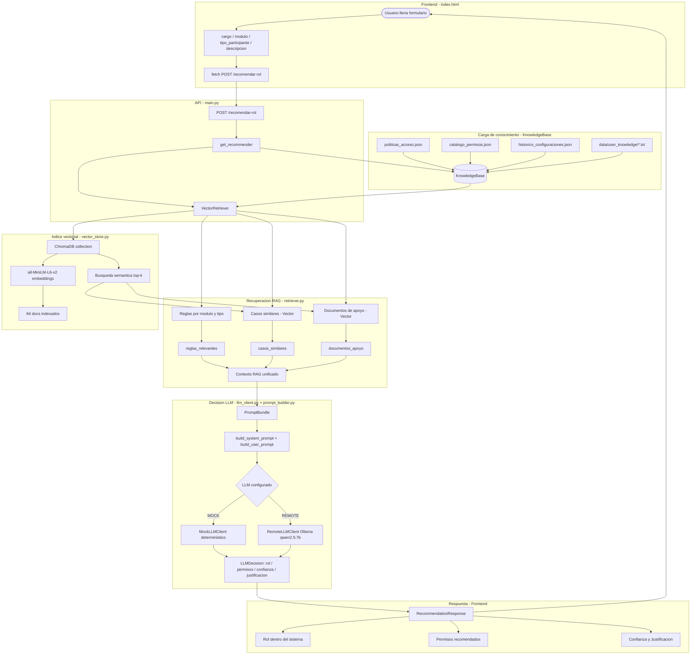
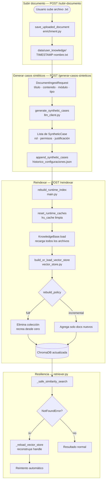
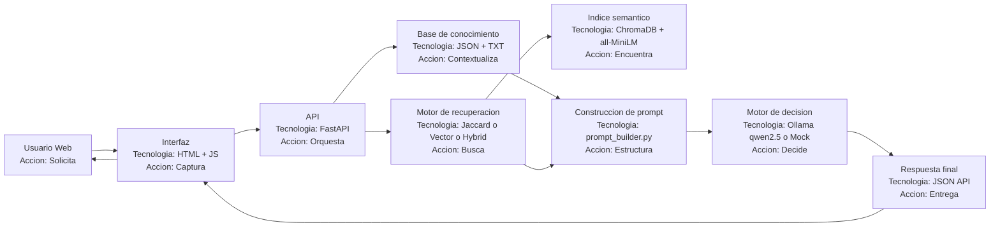
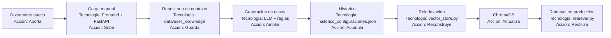
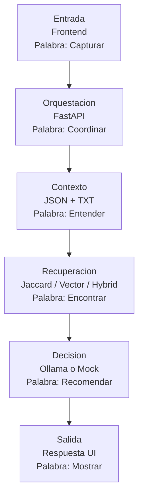

# Arquitectura del sistema RAG — Evergreen Multi-módulo

Diagramas de flujo del sistema. Dos vistas:
1. **Flujo principal** — recomendar rol (`POST /recomendar-rol`)
2. **Flujo enrichment** — subir documento y reindexar (`POST /subir-documento` + `POST /reindexar`)

---

## Diagrama 1 — Flujo principal: Recomendar rol

> **RAG en 3 líneas:**
> - **R (Retrieval)**: VectorRetriever consulta ChromaDB y recupera reglas, casos similares y documentos relevantes.
> - **A (Augmented)**: ese contexto se empaqueta con el perfil del usuario en un prompt enriquecido (PromptBundle).
> - **G (Generation)**: Ollama (o Mock) recibe ese prompt aumentado y genera la recomendación de rol y permisos.

---

## Diagrama 2 — Flujo enrichment: Subir documento y reindexar

---

## Diagramas ejecutivos (version clara para presentacion)

Estos diagramas complementan los tecnicos. Estan hechos para explicar el proceso en lenguaje simple, mostrando tecnologia por etapa y una palabra clave de accion.

### Diagrama 3 - Proceso completo con tecnologias

### Diagrama 4 - Flujo de enrichment (mejora continua)

### Diagrama 5 - Lectura rapida por etapa

---

## Referencias rápidas

| Archivo | Responsabilidad |
|---|---|
| `main.py` | Rutas FastAPI, wiring de dependencias, lru_cache |
| `recommender.py` | Orquesta el flujo RAG: retriever → prompt → LLM → respuesta |
| `retriever.py` | JaccardRetriever, VectorRetriever, HybridRetriever |
| `knowledge_base.py` | Carga y normaliza las tres fuentes de datos + user_knowledge |
| `prompt_builder.py` | Construye system prompt y user prompt dinámicamente por módulo |
| `llm_client.py` | MockLLMClient (determinístico) y RemoteLLMClient (Ollama) |
| `vector_store.py` | Construye/carga colección ChromaDB, gestiona embeddings |
| `enrichment.py` | Guarda documentos subidos, genera casos sintéticos, dispara reindex |
| `settings.py` | Variables de entorno: RETRIEVER_MODE, LLM_*, HYBRID_*, VECTOR_* |
| `models.py` | Schemas Pydantic: Request, Response, LLMDecision, SyntheticCase |
