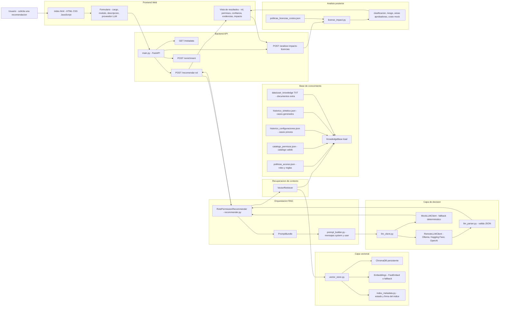

# Entrega 2 - Diagrama y Guia de Redaccion

Este documento sirve para dos cosas:

1. tener un diagrama tecnico claro para entender y exponer el sistema
2. usar una base organizada para redactar la Entrega 2 con el estado real del codigo

## 1. Diagrama principal del sistema

Este es el diagrama recomendado para explicar la arquitectura actual del proyecto.
Muestra componentes, tecnologias y flujo de informacion de punta a punta.



## 2. Como leer el diagrama

### Capa 1. Interfaz

El usuario interactua con `index.html`, que recoge el perfil a evaluar y el proveedor LLM seleccionado.

### Capa 2. API

`main.py` es la puerta de entrada. Expone los endpoints y decide que flujo activar:

- consulta de metadata
- recomendacion RAG
- enrichment y reindexacion
- analisis de impacto de licencias

### Capa 3. Orquestacion

`RolePermissionRecommender` coordina el flujo principal. No decide el retrieval ni el proveedor por si mismo; solo consume las dependencias activas y arma la respuesta final.

### Capa 4. Retrieval

El sistema soporta tres estrategias:

- `JaccardRetriever`: similitud simple por tokens
- `VectorRetriever`: busqueda semantica con ChromaDB
- `HybridRetriever`: reglas estructuradas + casos vectoriales con reranking

### Capa 5. Base de conocimiento

La informacion del dominio vive en archivos JSON y TXT. Esa informacion alimenta el retrieval y sirve como restriccion para evitar alucinaciones.

### Capa 6. LLM

La recomendacion la produce:

- un proveedor remoto compatible con OpenAI (`ollama`, `huggingface`, `openai`)
- o `MockLLMClient` cuando no hay configuracion completa o el LLM falla

Luego `llm_parser.py` valida la salida estructurada para que solo se acepten roles y permisos consistentes con el sistema.

### Capa 7. Analisis posterior

Despues de recomendar el rol y los permisos, la UI dispara un segundo flujo para inferir impacto de licencias y costos mock en sistemas externos.

## 3. Guion corto para exponer el diagrama

Pueden explicarlo asi:

1. El usuario entra por la interfaz web y diligencia su perfil.
2. FastAPI recibe la solicitud y consulta metadata o activa el flujo de recomendacion.
3. El recommender pide contexto al retriever.
4. El retriever busca reglas, casos y documentos en la base de conocimiento.
5. Si el modo es vectorial o hibrido, entra ChromaDB con embeddings.
6. Con ese contexto se construye un prompt estructurado.
7. El LLM decide rol, permisos, confianza y tipo de participante inferido.
8. La respuesta se valida y se devuelve con trazabilidad.
9. Luego se ejecuta un analisis adicional de impacto de licencias para mostrar costos y aprobaciones necesarias.

## 4. Componentes y tecnologias para nombrar en la sustentacion

| Componente | Tecnologia | Rol en el sistema |
|---|---|---|
| Frontend | HTML, CSS, JavaScript | captura datos y muestra resultados |
| API | FastAPI | expone endpoints y coordina el backend |
| Modelos | Pydantic | valida contratos de entrada y salida |
| Cliente HTTP | httpx | invoca LLMs remotos |
| Orquestador RAG | Python | coordina retrieval + prompt + LLM |
| Retrieval semantico | LangChain + ChromaDB | recupera contexto relevante |
| Embeddings | FastEmbed / fallback | transforma texto para indexacion y busqueda |
| LLM local | Ollama | comparacion local para demo |
| LLM remoto | Hugging Face / OpenAI | comparacion de modelos remotos |
| Knowledge Base | JSON + TXT | almacena reglas, permisos, historicos y documentos |
| Analisis mock | Python + JSON | estima impacto de licencias y costos |

## 5. Estructura recomendada para redactar la Entrega 2

El archivo `.doc` que revisamos esta casi vacio y funciona como plantilla. Con base en esa estructura, esto es lo que deberian escribir.

### 1. Arquitectura de la funcionalidad RAG

#### 1.1 Vista fisica de arquitectura

Aqui deben incluir el diagrama principal de este documento y explicar:

- cual es el frontend
- cual es la API
- donde esta la base de conocimiento
- como interactuan el retriever y el LLM
- donde aparece ChromaDB
- que rol juega el analisis de licencias

#### 1.2 Especificacion de componentes

Tabla sugerida:

| Nombre | Tipo | Descripcion | Version/Tecnologia | Consideraciones |
|---|---|---|---|---|
| `index.html` | UI | interfaz unica del sistema | HTML/JS | permite cambiar proveedor LLM |
| `main.py` | API | define endpoints y wiring | FastAPI | usa caches y reindexacion |
| `KnowledgeBase` | componente de datos | carga reglas, permisos e historicos | Python + JSON | fuente canonica del dominio |
| `VectorRetriever` | retrieval | busqueda semantica | LangChain + ChromaDB | requiere indice |
| `HybridRetriever` | retrieval | mezcla reglas estructuradas con casos vectoriales | Python | mejora trazabilidad |
| `RemoteLLMClient` | integracion LLM | llama proveedores remotos | httpx | compatible con OpenAI API |
| `MockLLMClient` | fallback | responde cuando falla el remoto | Python | evita caida del flujo |
| `license_impact.py` | analisis posterior | estima costos y riesgo | Python + JSON | salida mock academica |

### 2. Diseno de la funcionalidad RAG

#### 2.1 Diseno de la base de conocimiento

Deben describir al menos estos elementos:

- `politicas_acceso.json`
- `catalogo_permisos.json`
- `historico_configuraciones.json`
- `historico_sintetico.json`
- `data/user_knowledge/*.txt`
- `politicas_licencias_costos.json`

Lo correcto aqui es especificar:

- estructura de campos
- tipo de dato
- formato de archivo
- condiciones que deben cumplir
- como impactan el retrieval o la generacion

#### 2.2 Diseno de entradas

Entrada principal actual del sistema:

```json
{
  "cargo": "string",
  "modulo_asignado": "string",
  "descripcion_adicional": "string|null",
  "llm_provider": "ollama|huggingface|openai|null"
}
```

Punto importante para el informe:

- `tipo_participante` ya no se pide manualmente en la recomendacion principal
- ahora el sistema lo infiere a partir del contexto recuperado

Tambien pueden incluir entradas secundarias:

- carga de documentos
- generacion de casos sinteticos
- request de impacto de licencias

#### 2.3 Diseno de salidas

Salida principal:

```json
{
  "rol_recomendado": "Admin|Invitado",
  "permisos_recomendados": ["..."],
  "justificacion": "string",
  "nivel_confianza": "alto|medio|bajo",
  "tipo_participante_inferido": "string|null",
  "casos_similares_ref": ["..."],
  "retrieval_mode": "jaccard|vector|hybrid",
  "reglas_recuperadas_ref": ["..."],
  "casos_similares_score": [{"id": "string", "score": 0.0}],
  "documentos_apoyo_ref": ["..."],
  "reranking_info": {}
}
```

Salida complementaria:

- reporte de impacto de licencias y costos

#### 2.4 Diseno del prompt

Aqui deben explicar muy claramente dos partes:

- parte fija: instrucciones del sistema, formato JSON, restricciones y criterios de confianza
- parte variable: perfil del usuario, reglas recuperadas, casos similares, documentos de apoyo

Tambien pueden decir que:

- `prompt_builder.py` separa ambas partes
- el LLM responde solo JSON
- `llm_parser.py` valida la respuesta para controlar alucinaciones

### 3. Implementacion de la interaccion con cada LLM

#### 3.1 Comparacion de resultados con cada LLM

Lo ideal es una subseccion por integrante:

- Daniel: `ollama`
- Juan: el proveedor que use para su comparacion
- Simon: el proveedor que use para su comparacion

Para cada uno, deben mostrar:

- configuracion usada
- prompt enviado
- salida recibida
- comentario sobre calidad de la respuesta

#### 3.2 Valoracion de los LLM

Criterios recomendados:

- veracidad frente a las politicas
- precision en permisos recomendados
- calidad de la justificacion
- cumplimiento del formato JSON
- estabilidad o consistencia entre pruebas
- facilidad de integracion
- costo y disponibilidad para demo

### 4. Analisis de resultados y conclusiones

#### 4.1 Librerias y frameworks

Deben comentar la experiencia con:

- `fastapi`
- `pydantic`
- `httpx`
- `langchain`
- `langchain-chroma`
- `chromadb`
- `pymupdf`

#### 4.2 Herramientas

Deben comentar la experiencia con:

- `uv`
- `Ollama`
- VS Code
- terminal
- git y GitHub

#### 4.3 Conclusiones

Aqui conviene separar:

- conclusiones tecnicas del equipo
- conclusion sobre comparacion de LLMs
- conclusion sobre retrieval vectorial/hibrido
- consideraciones personales de cada integrante

## 6. Texto base que ya pueden reutilizar

### Parrafo corto para introducir la arquitectura

La arquitectura del sistema se compone de una interfaz web ligera, una API construida con FastAPI, una base de conocimiento en archivos estructurados del dominio Evergreen, un componente de retrieval configurable y una capa de decision basada en LLMs compatibles con la API de OpenAI. Sobre esta arquitectura se soporta no solo la recomendacion de rol y permisos, sino tambien un analisis posterior de impacto de licencias y costos en sistemas externos.

### Parrafo corto para explicar el flujo RAG

El flujo RAG inicia cuando el usuario envia su perfil. A partir de esa entrada, el sistema recupera reglas del dominio, casos historicos similares y documentos de apoyo. Ese contexto se inserta en un prompt estructurado que se envia al LLM seleccionado. La respuesta se valida contra el catalogo de roles y permisos del sistema para reducir alucinaciones y luego se devuelve con trazabilidad de las evidencias usadas.

### Parrafo corto para explicar el multi-LLM

La integracion multi-LLM se resolvio mediante un cliente remoto generico compatible con OpenAI Chat Completions. Esto permite cambiar entre Ollama, Hugging Face y OpenAI sin reescribir la logica central del sistema. El proveedor puede elegirse desde la configuracion o desde la interfaz, lo cual facilita la comparacion experimental entre modelos.

## 7. Siguiente paso recomendado

Cuando me pases el texto real que quieran usar en la Entrega 2, puedo hacer una segunda pasada y:

1. organizarlo por numerales del trabajo
2. completarlo con lenguaje academico
3. convertirlo en version final para pegar en Word
4. dejar listas tablas de componentes, entradas, salidas y criterios de evaluacion
