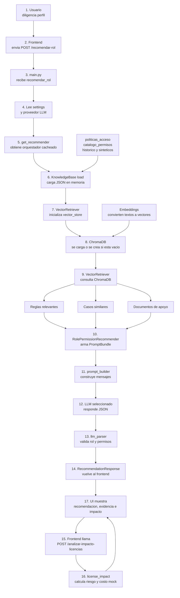

# Arquitectura y Desarrollo para Inteligencia Artificial Generativa

## Informe Entrega 2 - Diseno y Analisis de Resultados

### Asistente RAG Evergreen Multi-modulo para recomendacion de roles, permisos e impacto de licencias

**Autores:** Daniel Alejandro Garcia Zuluaica, Juan Esteban Quintero Herrera, Simon Ortiz Ohoa

**Proyecto:** Evergreen Multi-modulo, modulos ADM, DIS, PLA y FIN

**Fecha:** Abril de 2026

---

## 1. Arquitectura de la Funcionalidad RAG

La funcionalidad desarrollada corresponde a un asistente RAG para recomendar roles y permisos dentro de Evergreen. El sistema recibe el perfil de un usuario, recupera conocimiento del dominio a partir de politicas, catalogos, historicos y documentos extra, construye un prompt aumentado con evidencias y consulta un LLM configurable. La respuesta se valida contra los catalogos internos para reducir alucinaciones y finalmente se complementa con un analisis mock de impacto de licencias y costos.

La implementacion se desarrollo sin herramientas Low-Code. No se usaron GPTs personalizados, asistentes de Hugging Face, Gems de Gemini, LangFlow ni Flowise. La interaccion con los LLM se implemento directamente desde codigo Python usando `httpx` y endpoints compatibles con OpenAI Chat Completions.

### 1.1 Vista Fisica de Arquitectura



La arquitectura separa responsabilidades en capas. La interfaz captura la solicitud y permite seleccionar el proveedor LLM. FastAPI recibe `POST /recomendar-rol` y delega la recomendacion al orquestador RAG. `KnowledgeBase.load()` carga los archivos JSON en memoria; esta carga no es todavia la base vectorial. Despues, `VectorRetriever` inicializa o reutiliza ChromaDB y consulta el indice vectorial para recuperar reglas, casos y documentos de apoyo. Finalmente, el LLM seleccionado produce una respuesta JSON validada, y la UI hace una segunda llamada a `POST /analizar-impacto-licencias` para calcular el reporte mock de riesgo y costos.

### 1.2 Especificacion de Componentes

| Componente | Tipo | Descripcion | Tecnologia / Version | Consideraciones |
|---|---|---|---|---|
| `index.html` | Interfaz web | Captura perfil del usuario, proveedor LLM y muestra recomendacion, trazabilidad e impacto | HTML, CSS, JavaScript | Es una interfaz unica para todo el equipo y permite comparar proveedores |
| `main.py` | API / orquestacion HTTP | Define endpoints, inicializa caches, selecciona retriever y LLM | FastAPI, Uvicorn | Expone `/metadata`, `/recomendar-rol`, `/analizar-impacto-licencias` y endpoints de enrichment |
| `models.py` | Contratos de datos | Define entradas y salidas con validacion | Pydantic 2 | Controla tipos, valores permitidos y restricciones de longitud |
| `settings.py` | Configuracion | Lee `.env` y resuelve proveedor LLM, retrieval y vector store | Python dataclasses | Permite usar `ollama`, `huggingface` u `openai` |
| `KnowledgeBase` | Carga de conocimiento | Carga politicas, permisos e historicos | JSON + Python | Fuente canonica para validar roles y permisos |
| `JaccardRetriever` | Recuperacion baseline | Recupera reglas y casos por similitud de tokens | Python | No requiere indice vectorial |
| `VectorRetriever` | Recuperacion semantica | Busca reglas, historicos y documentos con embeddings | LangChain + ChromaDB | Requiere indice persistente |
| `HybridRetriever` | Recuperacion combinada | Usa reglas estructuradas y casos vectoriales con reranking | Python + ChromaDB | Mejora trazabilidad en dominios estructurados |
| `vector_store.py` | Indice vectorial | Construye y carga ChromaDB persistente | ChromaDB, FastEmbed | Indexa reglas, permisos, historicos y documentos |
| `prompt_builder.py` | Construccion de prompt | Genera mensajes system/user con contexto recuperado | Python | Separa instrucciones fijas y contenido variable |
| `RemoteLLMClient` | Integracion LLM | Invoca proveedores remotos compatibles con OpenAI | httpx | Soporta Ollama, Hugging Face y OpenAI |
| `MockLLMClient` | Fallback | Produce decision deterministica si el LLM falla | Python | Evita que la funcionalidad quede inutilizable |
| `llm_parser.py` | Validacion anti-alucinacion | Extrae JSON y valida roles/permisos | Python | Filtra permisos no existentes y rechaza respuestas invalidas |
| `enrichment.py` | Enriquecimiento | Guarda documentos, lee PDFs/texto y genera casos sinteticos | Python, PyMuPDF | Reindexa para que el conocimiento nuevo se use en retrieval |
| `license_impact.py` | Analisis posterior | Evalua impacto mock de licencias, costos y aprobaciones | Python + JSON | Complementa la recomendacion con riesgo operativo |

---

## 2. Diseno de la Funcionalidad RAG

### 2.1 Diseno de la Base de Conocimiento

La base de conocimiento esta compuesta por archivos estructurados en `data/`. Estos archivos representan el conocimiento de dominio que el LLM necesita para responder con evidencia y no desde conocimiento generico.

| Elemento | Archivo | Formato | Estructura principal | Condiciones |
|---|---|---|---|---|
| Politicas de acceso | `data/politicas_acceso.json` | JSON | `roles[]`, `reglas[]` | Cada regla debe tener `modulo`, `tipo_participante`, `rol_preferido` y `permisos` |
| Catalogo de permisos | `data/catalogo_permisos.json` | JSON array | `nombre`, `modulo`, `descripcion` | Todo permiso recomendado debe existir aqui |
| Historico de configuraciones | `data/historico_configuraciones.json` | JSON array | `id`, `cargo`, `modulo_asignado`, `tipo_participante`, `rol`, `permisos` | Sirve como precedente para similitud |
| Historico sintetico | `data/historico_sintetico.json` | JSON array | igual al historico base | Se genera desde endpoints de enrichment |
| Documentos del usuario | `data/user_knowledge/*.txt` | TXT | texto libre con modulo codificado en nombre | Se usa como evidencia adicional en modo vector/hybrid |
| Politicas de licencias | `data/politicas_licencias_costos.json` | JSON | sistemas externos, permisos externos, reglas de impacto | Alimenta el analisis posterior de licencias |

El archivo `politicas_acceso.json` define dos roles principales: `Admin` e `Invitado`. Tambien define reglas por modulo y tipo de participante. El catalogo de permisos funciona como control anti-alucinacion, porque el parser elimina o rechaza permisos que no correspondan a permisos conocidos por Evergreen.

### 2.2 Diseno de Entradas

#### Entrada principal de recomendacion

Endpoint: `POST /recomendar-rol`

```json
{
  "cargo": "Analista de soporte ADM",
  "modulo_asignado": "ADM",
  "descripcion_adicional": "Gestiona usuarios y revisa permisos.",
  "llm_provider": "openai"
}
```

| Campo | Tipo | Requerido | Restricciones | Uso |
|---|---|---|---|---|
| `cargo` | string | Si | 1 a 100 caracteres | Describe el rol laboral del usuario |
| `modulo_asignado` | string | Si | 1 a 20 caracteres | Filtra reglas y documentos por modulo |
| `descripcion_adicional` | string o null | No | maximo 500 caracteres | Da mas contexto al retriever y al LLM |
| `llm_provider` | enum o null | No | `ollama`, `huggingface`, `openai` | Permite seleccionar modelo desde la UI |

Una decision de diseno importante es que `tipo_participante` ya no se pide como entrada principal. El sistema lo infiere a partir del cargo, la descripcion, las reglas recuperadas y los casos historicos similares.

#### Entrada de carga de documentos

Endpoint: `POST /enrichment/document`

| Campo | Tipo | Requerido | Restricciones | Uso |
|---|---|---|---|---|
| `modulo_asignado` | string | Si | 1 a 20 caracteres | Asocia el documento a un modulo |
| `title` | string | Si | 3 a 120 caracteres | Nombre legible del documento |
| `content` | string | Si | 20 a 20000 caracteres | Texto que sera indexado |

#### Entrada de generacion de casos sinteticos

Endpoint: `POST /enrichment/synthetic-cases`

| Campo | Tipo | Requerido | Restricciones | Uso |
|---|---|---|---|---|
| `cargo` | string | Si | 3 a 120 caracteres | Cargo base para los casos |
| `modulo_asignado` | string | Si | 1 a 20 caracteres | Modulo del caso sintetico |
| `tipo_participante` | string | Si | 3 a 100 caracteres | Tipo base usado para buscar regla |
| `descripcion_base` | string | Si | 10 a 500 caracteres | Texto base para variantes |
| `count` | integer | Si | 1 a 10 | Numero de casos a generar |

#### Entrada de impacto de licencias

Endpoint: `POST /analizar-impacto-licencias`

| Campo | Tipo | Requerido | Uso |
|---|---|---|---|
| `cargo` | string | Si | Contexto del usuario evaluado |
| `modulo_asignado` | string | Si | Filtra reglas de impacto por modulo |
| `tipo_participante_inferido` | string o null | No | Contexto adicional para el reporte |
| `rol_recomendado` | `Admin` o `Invitado` | No | Rol que viene de la recomendacion |
| `permisos_recomendados` | list[string] | No | Permisos Evergreen a evaluar |
| `permisos_externos_solicitados` | list[string] | No | Permisos externos evaluados directamente |

### 2.3 Diseno de Salidas

#### Salida principal de recomendacion

```json
{
  "rol_recomendado": "Admin",
  "permisos_recomendados": ["gestionar_usuarios", "configurar_permisos"],
  "justificacion": "La recomendacion se basa en reglas ADM y casos similares...",
  "nivel_confianza": "medio",
  "tipo_participante_inferido": "Administrador",
  "casos_similares_ref": ["ADM-001"],
  "retrieval_mode": "vector",
  "reglas_recuperadas_ref": ["ADM:Administrador"],
  "casos_similares_score": [{"id": "ADM-001", "score": 0.74}],
  "documentos_apoyo_ref": ["Impacto licencias accesos ADM"],
  "reranking_info": null
}
```

| Campo | Tipo | Condicion | Uso |
|---|---|---|---|
| `rol_recomendado` | `Admin` o `Invitado` | Debe existir en politicas | Resultado principal |
| `permisos_recomendados` | list[string] | Cada permiso debe existir en catalogo | Acciones sugeridas |
| `justificacion` | string | Explica evidencia usada | Trazabilidad para el usuario |
| `nivel_confianza` | `alto`, `medio`, `bajo` | Calculado por LLM o fallback | Indica certeza operativa |
| `tipo_participante_inferido` | string o null | Inferido del contexto | Reemplaza entrada manual antigua |
| `casos_similares_ref` | list[string] | IDs historicos | Trazabilidad |
| `retrieval_mode` | `jaccard`, `vector`, `hybrid` | Segun configuracion | Auditoria tecnica |
| `reglas_recuperadas_ref` | list[string] | modulo:tipo | Muestra reglas usadas |
| `casos_similares_score` | list[object] | id y score | Muestra similitud |
| `documentos_apoyo_ref` | list[string] | titulos o archivos | Evidencia documental |
| `reranking_info` | object o null | Solo en hybrid | Explica reranking aplicado |

#### Salida de impacto de licencias

| Campo | Tipo | Uso |
|---|---|---|
| `clasificacion_general` | enum | Resume si hay costo, licencia o validacion contractual |
| `riesgo_general` | `bajo`, `medio`, `alto` | Mayor riesgo encontrado |
| `requiere_licencia_adicional` | boolean | Indica necesidad de seat o licencia |
| `requiere_modulo_adicional` | boolean | Indica dependencia de modulo externo |
| `costo_estimado_mock` | list[string] | Rangos mock de costo |
| `areas_aprobadoras` | list[string] | Areas que deben validar |
| `acciones_sugeridas` | list[string] | Pasos operativos recomendados |
| `impactos` | list[object] | Detalle por regla de impacto |
| `evidencias_recuperadas` | list[object] | Evidencia del catalogo y retrieval |
| `mensaje` | string | Explicacion resumida |

### 2.4 Diseno del Prompt

El prompt se construye en `src/rag_adm/prompt_builder.py` y separa parte fija y parte variable.

#### Parte fija

La parte fija define el comportamiento esperado del modelo:

- actuar como asistente experto en Evergreen
- decidir rol, permisos, justificacion, confianza y tipo inferido
- responder solo con JSON valido
- usar unicamente roles y permisos validos
- seguir criterios de confianza definidos

#### Parte variable

La parte variable se arma en cada solicitud:

- perfil del usuario
- reglas del dominio recuperadas
- casos historicos similares
- documentos de apoyo
- lista de roles validos
- lista de permisos validos

El prompt exige una salida con esta forma:

```json
{
  "rol_recomendado": "<uno de los roles validos>",
  "permisos_recomendados": ["<permiso1>", "<permiso2>"],
  "justificacion": "<explicacion citando reglas o casos>",
  "nivel_confianza": "<alto | medio | bajo>",
  "tipo_participante_inferido": "<tipo inferido>"
}
```

Despues de recibir la respuesta, `llm_parser.py` extrae el JSON, valida el rol y filtra permisos no existentes. Si la respuesta es invalida, se activa el fallback deterministico.

---

## 3. Implementacion de la Interaccion con cada LLM

La integracion con LLMs se implemento en `src/rag_adm/llm_client.py`. La clase `RemoteLLMClient` envia mensajes al endpoint `/chat/completions` del proveedor configurado. La clase `MockLLMClient` opera como respaldo cuando no hay proveedor remoto configurado o cuando el modelo responde con un formato invalido.

El proyecto soporta tres proveedores configurables:

| Proveedor | Modelo sugerido | Base URL | Tipo de uso |
|---|---|---|---|
| Ollama | `qwen2.5:7b` | `http://127.0.0.1:11434/v1` | LLM local para demo sin costo |
| Hugging Face | `meta-llama/Llama-3.1-8B-Instruct` | `https://router.huggingface.co/v1` | Modelo remoto via HF Router |
| OpenAI | `gpt-5-mini` | `https://api.openai.com/v1` | Modelo remoto para comparacion |

### 3.1 Comparacion de Resultados con cada LLM

Para la comparacion se recomienda usar el mismo caso de prueba en los tres modelos:

```json
{
  "cargo": "Analista de soporte ADM",
  "modulo_asignado": "ADM",
  "descripcion_adicional": "Gestiona usuarios, revisa permisos y audita accesos."
}
```

#### Ollama - `qwen2.5:7b`

Configuracion:

```bash
OLLAMA_API_KEY=ollama
OLLAMA_BASE_URL=http://127.0.0.1:11434/v1
OLLAMA_MODEL=qwen2.5:7b
LLM_DEFAULT_PROVIDER=ollama
```

Evidencia pendiente:

- captura del request enviado desde la UI
- captura de la respuesta
- observacion sobre si respeta JSON y si justifica con evidencia

#### Hugging Face - `meta-llama/Llama-3.1-8B-Instruct`

Configuracion:

```bash
HUGGINGFACE_API_KEY=<token>
HUGGINGFACE_BASE_URL=https://router.huggingface.co/v1
HUGGINGFACE_MODEL=meta-llama/Llama-3.1-8B-Instruct
LLM_DEFAULT_PROVIDER=huggingface
```

Evidencia pendiente:

- captura del request enviado desde la UI
- captura de la respuesta
- observacion sobre precision, formato y latencia

#### OpenAI - `gpt-5-mini`

Configuracion:

```bash
OPENAI_API_KEY=<token>
OPENAI_BASE_URL=https://api.openai.com/v1
OPENAI_MODEL=gpt-5-mini
LLM_DEFAULT_PROVIDER=openai
```

Evidencia pendiente:

- captura del request enviado desde la UI
- captura de la respuesta
- observacion sobre calidad de razonamiento y cumplimiento del esquema

### 3.2 Valoracion de los LLM

| Criterio | Descripcion | Ollama | Hugging Face | OpenAI |
|---|---|---|---|---|
| Veracidad | La respuesta coincide con reglas y permisos del dominio | Pendiente de captura | Pendiente de captura | Pendiente de captura |
| Precision | Recomienda permisos adecuados para el modulo y cargo | Pendiente de captura | Pendiente de captura | Pendiente de captura |
| Cumplimiento JSON | Responde con el esquema esperado sin texto adicional | Pendiente de captura | Pendiente de captura | Pendiente de captura |
| Justificacion | Explica la decision usando reglas, casos o documentos | Pendiente de captura | Pendiente de captura | Pendiente de captura |
| Estabilidad | Mantiene respuestas consistentes ante entradas similares | Pendiente de captura | Pendiente de captura | Pendiente de captura |
| Integracion | Facilidad para conectar endpoint, key y modelo | Alta en local | Alta con token HF | Alta con API key |
| Costo / disponibilidad | Viabilidad para clase y demo | Sin costo API, requiere maquina local | Depende de cuota HF | Depende de credito API |

La comparacion debe completarse con capturas reales de ejecucion. Desde el punto de vista de arquitectura, los tres proveedores usan el mismo cliente remoto, por lo que la comparacion evalua principalmente calidad de salida, estabilidad, formato y latencia, no cambios de codigo entre modelos.

---

## 4. Analisis de Resultados y Conclusiones

### 4.1 Consideraciones de las Librerias y Frameworks

| Libreria / Framework | Experiencia de uso | Aporte al proyecto |
|---|---|---|
| FastAPI | Facilito exponer endpoints con documentacion automatica | Permite probar `/docs`, validar contratos y organizar servicios |
| Pydantic | Simplifico validacion de entradas y salidas | Reduce errores de formato y define contratos claros |
| httpx | Permite llamadas HTTP sincronas al proveedor LLM | Se usa para invocar endpoints compatibles con OpenAI |
| LangChain | Apoya integracion con documentos y vector store | Facilita abstraccion sobre ChromaDB |
| ChromaDB | Permite busqueda semantica persistente | Soporta retrieval vectorial e hibrido |
| FastEmbed | Genera embeddings locales | Evita depender de un proveedor externo para embeddings |
| PyMuPDF | Permite extraer texto de PDFs cargados | Habilita enrichment documental |
| Uvicorn | Ejecuta la API localmente | Permite demo web rapida |

### 4.2 Analisis de las Herramientas

| Herramienta | Uso | Observacion |
|---|---|---|
| uv | Gestion de dependencias y entorno virtual | Acelera instalacion y mantiene lockfile reproducible |
| Ollama | Ejecucion local de modelos | Es util para demo sin depender de internet, aunque exige recursos locales |
| VS Code | Edicion y revision del proyecto | Facilita navegacion entre backend, datos y docs |
| Git | Control de versiones | Permite consolidar avances y recuperar cambios |
| GitHub | Repositorio y colaboracion | Permite compartir entrega, revisar historial y preparar PR si aplica |
| FastAPI docs | Prueba manual de endpoints | Ayuda a demostrar contratos sin crear clientes externos |

### 4.3 Conclusiones

1. El patron RAG permite que las recomendaciones no dependan solo del conocimiento general del LLM, sino de reglas, historicos y documentos especificos de Evergreen.
2. La validacion contra catalogos locales es clave para reducir alucinaciones en roles y permisos.
3. La separacion entre retriever, prompt, cliente LLM y parser permite cambiar tecnologias sin reescribir el flujo completo.
4. El soporte multi-LLM permite comparar modelos bajo una misma interfaz y un mismo caso de prueba.
5. El modo vectorial mejora la recuperacion de documentos y casos semanticamente relacionados.
6. El modo hibrido aporta una combinacion util entre reglas estructuradas y similitud semantica.
7. El analisis de licencias muestra que la recomendacion de permisos puede conectarse con decisiones posteriores de costo, riesgo y aprobacion.
8. La interfaz web facilita la presentacion porque centraliza seleccion de modelo, recomendacion, trazabilidad e impacto.

### Consideraciones personales sugeridas

#### Daniel Alejandro Garcia Zuluaica

El desarrollo permitio entender como conectar un LLM local mediante una API compatible con OpenAI y como integrarlo dentro de una arquitectura RAG sin depender de herramientas Low-Code.

#### Juan Esteban Quintero Herrera

La comparacion de proveedores muestra que el valor no esta solo en obtener una respuesta generada, sino en controlar el formato, validar la salida y mantener trazabilidad con la base de conocimiento.

#### Simon Ortiz Ohoa

La construccion del retriever y la base vectorial evidencia que la calidad de la respuesta depende fuertemente de la calidad del contexto recuperado y de la organizacion de los datos del dominio.

---

## Anexos Recomendados para la Entrega

### Anexo A. Comando de ejecucion recomendado para demo

```bash
RETRIEVER_MODE=vector \
VECTOR_REBUILD_INDEX=false \
LLM_DEFAULT_PROVIDER=openai \
python -m uvicorn rag_adm.main:app --app-dir src --host 127.0.0.1 --port 8000
```

### Anexo B. Endpoints usados

| Endpoint | Metodo | Proposito |
|---|---|---|
| `/` | GET | Interfaz principal |
| `/metadata` | GET | Catalogos, proveedores y estado del indice |
| `/recomendar-rol` | POST | Recomendacion RAG |
| `/analizar-impacto-licencias` | POST | Reporte de impacto mock |
| `/enrichment/document` | POST | Agregar documento textual |
| `/enrichment/document-upload` | POST | Subir archivo `.txt`, `.md` o `.pdf` |
| `/enrichment/synthetic-cases` | POST | Generar casos sinteticos |
| `/enrichment/reindex` | POST | Reindexar ChromaDB |

### Anexo C. Archivos clave del repositorio

| Ruta | Uso |
|---|---|
| `README.md` | Guia general del proyecto |
| `docs/entrega2_diagrama_y_guia.md` | Diagrama y guia de exposicion |
| `src/rag_adm/main.py` | API |
| `src/rag_adm/recommender.py` | Orquestador RAG |
| `src/rag_adm/retriever.py` | Modos de recuperacion |
| `src/rag_adm/llm_client.py` | Integracion LLM |
| `src/rag_adm/prompt_builder.py` | Prompt |
| `src/rag_adm/llm_parser.py` | Validacion de salida |
| `src/rag_adm/license_impact.py` | Analisis de licencias |
| `data/politicas_acceso.json` | Politicas de acceso |
| `data/catalogo_permisos.json` | Catalogo de permisos |
| `data/politicas_licencias_costos.json` | Reglas mock de impacto |
