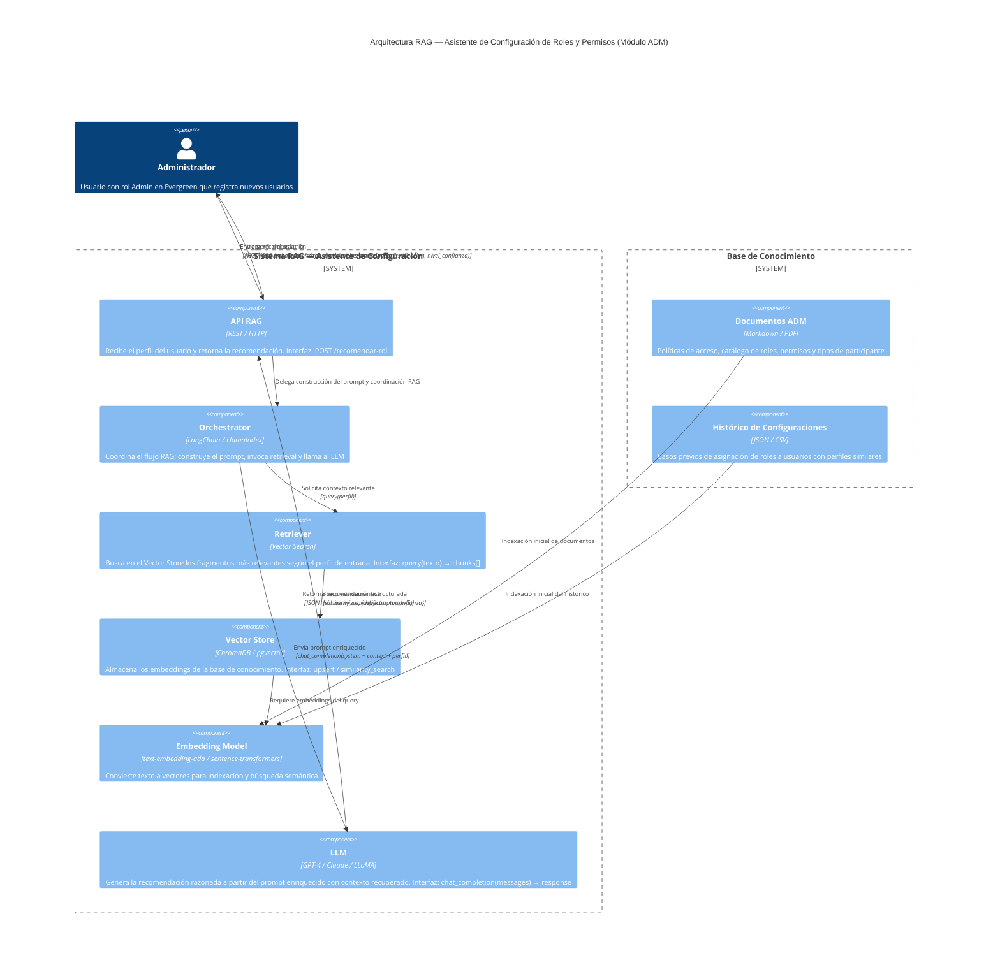

# Desarrollo de Software para Inteligencia Artificial Generativa

**Informe Técnico – Caso de Aplicación**
**Módulo ADM (Administración) de Evergreen**

**Autores:**
- Daniel Alejandro Garcia Zuluaica
- Juan Esteban Quintero Herrera
- Simon Ortiz Ohoa

**Medellín, 2026**

---

## Historia de Versiones

| Versión | Fecha | Descripción del Cambio |
|:---:|:---:|---|
| 1.0 | 2026-04-11 | Creación inicial del documento |
| 1.1 | 2026-04-11 | Diligenciamiento completo del informe técnico |
| 1.2 | 2026-04-17 | Sección 2.1 corregida para reflejar la estructura real de los archivos JSON implementados |

---

> **Repositorio público del proyecto:** todas las rutas de archivo referenciadas en este documento (`data/`, `src/rag_adm/`, etc.) corresponden a la estructura del repositorio público disponible en:
> **https://github.com/alejandrodgz/ia-generativa-rag**

---

## CONTENIDO

1. [Asistente de Configuración de Roles y Permisos](#1-asistente-de-configuración-de-roles-y-permisos)
   - 1.1 [Presentación de la Funcionalidad RAG](#11-presentación-de-la-funcionalidad-rag)
   - 1.2 [Esquema Explicativo de la Funcionalidad RAG](#12-esquema-explicativo-de-la-funcionalidad-rag)
2. [Elementos de Datos en la Funcionalidad RAG](#2-elementos-de-datos-en-la-funcionalidad-rag)
   - 2.1 [Definición de la Base de Conocimiento](#21-definición-de-la-base-de-conocimiento)
   - 2.2 [Definición de Entradas](#22-definición-de-entradas)
   - 2.3 [Definición de Salidas](#23-definición-de-salidas)
3. [Propuesta de Arquitectura de la Solución](#3-propuesta-de-arquitectura-de-la-solución)
4. [Conclusiones del Caso de Aplicación](#4-conclusiones-del-caso-de-aplicación)
5. [Referencias](#referencias)

---

## 1. Asistente de Configuración de Roles y Permisos

### 1.1 Presentación de la Funcionalidad RAG

El módulo ADM de Evergreen gestiona usuarios, roles, permisos y el control de acceso sobre cada página, opción y módulo del sistema. Actualmente, la asignación de roles y permisos se realiza de forma manual por un administrador, lo cual introduce el riesgo de errores de configuración: accesos indebidos, permisos insuficientes o configuraciones inconsistentes entre usuarios con perfiles similares.

La funcionalidad RAG propuesta es un **Asistente de Configuración de Roles y Permisos**: dado el perfil de un nuevo usuario (su cargo dentro de la organización, el módulo de Evergreen al que pertenece y su tipo de participación en la agrocadena), el sistema recupera las políticas de acceso y los precedentes de configuración existentes en la base de conocimiento del dominio ADM, y usa un LLM para razonar y generar una recomendación fundamentada del rol y los permisos que deben asignarse a ese usuario.

**Justificación de utilidad para el módulo ADM:**
- Reduce errores humanos en la asignación de accesos críticos del sistema.
- Garantiza consistencia entre usuarios con perfiles equivalentes.
- Acelera el proceso de onboarding de nuevos participantes en la plataforma Evergreen.
- Complementa directamente el flujo de login y asignación de rol ya implementado con Node-RED en el módulo anterior, añadiéndole razonamiento inteligente.

---

### 1.2 Esquema Explicativo de la Funcionalidad RAG

El siguiente esquema ilustra la funcionalidad desde la perspectiva de negocio:

```
┌─────────────────────────────────────────────────────────────────┐
│                  ADMINISTRADOR DE EVERGREEN                     │
│                                                                 │
│  Registra un nuevo usuario con los siguientes datos de perfil:  │
│    · Cargo: "Coordinador de Agrocadena"                         │
│    · Módulo asignado: ADM                                       │
│    · Tipo de participante: Productor                            │
└───────────────────────────┬─────────────────────────────────────┘
                            │  solicita recomendación
                            ▼
┌─────────────────────────────────────────────────────────────────┐
│           ASISTENTE DE CONFIGURACIÓN (Funcionalidad RAG)        │
│                                                                 │
│  1. Consulta la base de conocimiento:                           │
│     · Políticas de acceso de Evergreen ADM                      │
│     · Histórico de configuraciones de usuarios similares        │
│     · Definición de roles: Admin vs. Invitado                   │
│     · Tabla de permisos por módulo/página/opción                │
│                                                                 │
│  2. El LLM razona sobre el perfil + conocimiento recuperado     │
│     y genera una recomendación explicada                        │
└───────────────────────────┬─────────────────────────────────────┘
                            │  entrega resultado
                            ▼
┌─────────────────────────────────────────────────────────────────┐
│                     RECOMENDACIÓN GENERADA                      │
│                                                                 │
│  · Rol sugerido: Invitado                                       │
│  · Permisos sugeridos: ver agrocadenas, ver etapas              │
│  · Justificación: "Según las políticas del módulo ADM,          │
│    un Coordinador de tipo Productor tiene acceso de lectura     │
│    sobre agrocadenas pero no puede modificar usuarios ni        │
│    configurar permisos del sistema..."                          │
└─────────────────────────────────────────────────────────────────┘
                            │  el administrador acepta o ajusta
                            ▼
                   [Configuración aplicada en Evergreen ADM]
```

*Figura 1. Esquema Explicativo de la Funcionalidad RAG — Asistente de Configuración de Roles y Permisos.*

---

## 2. Elementos de Datos en la Funcionalidad RAG

### 2.1 Definición de la Base de Conocimiento

Estos tres archivos conforman la base de conocimiento porque contienen todo el conocimiento del dominio que el LLM necesita para razonar: las reglas del negocio (políticas), el vocabulario controlado de acciones posibles (catálogo de permisos) y los precedentes reales de decisiones pasadas (histórico). Sin estos elementos el LLM no tendría contexto específico del módulo ADM y generaría recomendaciones genéricas o incorrectas. Se compone de tres archivos JSON ubicados en `data/` del repositorio público del proyecto (https://github.com/alejandrodgz/ia-generativa-rag):

| Elemento | Archivo | Contenido | Formato | Condiciones |
|---|---|---|---|---|
| **Políticas de acceso y roles** | `politicas_acceso.json` | Define los roles disponibles (`Admin`, `Invitado`) con sus permisos por módulo, y las reglas de acceso por tipo de participante (qué rol y permisos corresponden a cada combinación de módulo + tipo de participante) | JSON — dos secciones: `roles[]` y `reglas[]` | Debe estar actualizado con la versión vigente del sistema. Contiene simultáneamente el catálogo de roles y la descripción de tipos de participante válidos. Sin este archivo el LLM no puede razonar correctamente |
| **Catálogo de permisos** | `catalogo_permisos.json` | Listado de todos los permisos disponibles en el módulo ADM, con nombre, módulo asociado y descripción de la acción que habilita | JSON — array de objetos `{nombre, modulo, descripcion}` | Cada permiso debe tener nombre único, módulo y descripción. El LLM usa este catálogo para validar y restringir los permisos que puede recomendar |
| **Histórico de configuraciones** | `historico_configuraciones.json` | Registro de asignaciones de roles y permisos previas para usuarios con cargos y tipos de participante del módulo ADM | JSON — array de objetos `{id, cargo, modulo_asignado, tipo_participante, descripcion_adicional, rol, permisos[]}` | Mínimo 10 casos para que el retrieval sea representativo. Cada caso debe tener `id` único para trazabilidad. El retriever usa similitud de tokens (Jaccard) sobre los campos de texto para encontrar los casos más relevantes |

---

### 2.2 Definición de Entradas

Estos cuatro campos son las entradas porque representan el perfil mínimo necesario para identificar qué tipo de usuario se está configurando: el cargo describe sus responsabilidades, el módulo delimita su ámbito de trabajo en Evergreen, el tipo de participante determina su rol en la agrocadena, y la descripción adicional permite capturar contexto que no cabe en los campos estructurados. Juntos forman la consulta que el retriever usa para buscar casos similares en la base de conocimiento.

| Entrada | Tipo | Descripción | Condiciones |
|---|---|---|---|
| `cargo` | `string` | Cargo o rol organizacional del nuevo usuario dentro de la empresa u organización (ej: "Coordinador de Agrocadena", "Analista ADM") | Requerido. No vacío. Longitud máxima 100 caracteres |
| `modulo_asignado` | `string` | Módulo de Evergreen al que pertenece el usuario (ej: "ADM", "SUM", "COM") | Requerido. Debe corresponder a un módulo válido del sistema Evergreen |
| `tipo_participante` | `string` | Tipo de participante del usuario en la agrocadena (ej: "Productor", "Distribuidor", "Invitado externo") | Requerido. Debe pertenecer al catálogo de tipos de participante de Evergreen |
| `descripcion_adicional` | `string` | Contexto adicional libre sobre las responsabilidades del usuario que pueda orientar la recomendación | Opcional. Longitud máxima 500 caracteres |

---

### 2.3 Definición de Salidas

Estos cinco campos son las salidas porque cubren los tres requisitos de una recomendación accionable y auditable: la decisión en sí (`rol_recomendado` y `permisos_recomendados`), la trazabilidad de por qué se tomó esa decisión (`justificacion` y `casos_similares_ref`), y un indicador de confianza (`nivel_confianza`) que permite al administrador saber cuándo debe revisar manualmente el resultado antes de aplicarlo.

| Salida | Tipo | Descripción | Condiciones |
|---|---|---|---|
| `rol_recomendado` | `"Admin" \| "Invitado"` | Rol que el LLM recomienda asignar al usuario según su perfil y las políticas del sistema | Siempre presente. Debe ser uno de los valores del catálogo de roles de Evergreen |
| `permisos_recomendados` | `string[]` | Lista de nombres de permisos específicos que se sugieren activar para el usuario | Siempre presente. Cada elemento debe existir en el catálogo de permisos. Puede ser lista vacía solo en caso excepcional justificado |
| `justificacion` | `string` | Explicación en lenguaje natural del razonamiento del LLM: por qué recomienda ese rol y esos permisos, con referencias a las políticas recuperadas | Siempre presente. Mínimo 50 caracteres. Debe citar al menos una fuente de la base de conocimiento |
| `nivel_confianza` | `"alto" \| "medio" \| "bajo"` | Indicador de qué tan seguro está el LLM de su recomendación, basado en la similitud con casos previos en la base de conocimiento | Siempre presente. Si es `"bajo"` se debe recomendar al administrador revisión manual |
| `casos_similares_ref` | `string[]` | Referencias a configuraciones del histórico que sirvieron de base para la recomendación | Opcional. Útil para la auditabilidad de la decisión |

---

> **Nota sobre el Retriever — estado actual y evolución prevista**
>
> En la implementación actual se usa **similitud de Jaccard** sobre los campos de texto de los archivos JSON. Jaccard compara conjuntos de tokens entre la consulta y cada caso del histórico, sin requerir modelos de embeddings ni infraestructura externa — lo que lo hace ideal para prototipar y validar el flujo RAG completo con datos reales desde el primer día.
>
> La transición a un **retriever vectorial** (ChromaDB o pgvector) consiste en reemplazar el componente `JaccardRetriever` por un `VectorRetriever` que indexe los mismos archivos JSON como embeddings. El resto del sistema (API, prompt, LLM) no cambia, ya que ambos retrievers implementan la misma interfaz `Retriever`. Esta sustitución está planificada para la siguiente entrega mediante la variable de entorno `RETRIEVER_MODE=vector`.

---

## 3. Propuesta de Arquitectura de la Solución

La arquitectura propuesta sigue el modelo C4 a nivel de componentes, describiendo cómo interactúan los elementos del sistema RAG:



*Figura 2. Diagrama de la Propuesta de Arquitectura (modelo C4 — nivel de componentes).*

**Descripción de los componentes:**

| Componente | Responsabilidad | Interfaz relevante |
|---|---|---|
| **API RAG** | Punto de entrada REST del sistema. Valida la entrada y retorna la respuesta estructurada al administrador | `POST /recomendar-rol` → `{cargo, modulo_asignado, tipo_participante, descripcion_adicional?}` |
| **Orchestrator** | Coordina el flujo RAG completo: recibe la consulta, invoca el retriever, construye el prompt aumentado y llama al LLM | Interno — integra Retriever y LLM en un pipeline secuencial |
| **Retriever** | Convierte la consulta en un vector y busca los fragmentos más similares en el Vector Store | `query(texto: string, top_k: int) → chunks: string[]` |
| **Vector Store** | Base de datos vectorial que almacena los embeddings de toda la base de conocimiento | `similarity_search(vector, top_k) → documentos relevantes` |
| **Embedding Model** | Transforma texto (documentos y consultas) en vectores de alta dimensionalidad para búsqueda semántica | `embed(texto: string) → vector: float[]` |
| **LLM** | Modelo de lenguaje que recibe el prompt enriquecido (perfil + contexto recuperado) y genera la recomendación con justificación | `chat_completion(messages: Message[]) → {rol, permisos, justificacion, nivel_confianza}` |
| **Documentos ADM** | Políticas de acceso, catálogo de roles, permisos y tipos de participante del módulo ADM de Evergreen | Fuente estática — se indexa una vez y se actualiza cuando cambian las políticas |
| **Histórico de Configuraciones** | Casos previos de asignación de roles para usuarios con perfiles similares | Fuente dinámica — se actualiza cada vez que el administrador confirma una nueva configuración |

---

## 4. Conclusiones del Caso de Aplicación

- **La funcionalidad RAG propuesta aporta valor real al módulo ADM** al transformar un proceso manual y propenso a errores (asignación de roles y permisos) en un proceso asistido por IA, con recomendaciones fundamentadas en políticas del dominio.

- **SDD y RAG son metodologías complementarias**: aplicar Spec-Driven Development al diseño de esta funcionalidad (definir primero los contratos de entrada y salida antes de implementar) reduce la ambigüedad en la integración entre componentes y facilita el trabajo paralelo del equipo.

- **La arquitectura RAG es modular e intercambiable**: cada componente (LLM, Vector Store, Embedding Model) puede reemplazarse sin afectar el resto del sistema siempre que se respeten las interfaces definidas, lo que reduce el acoplamiento tecnológico.

- **La base de conocimiento es el elemento más crítico**: la calidad de las recomendaciones del LLM depende directamente de que los documentos de políticas estén completos, actualizados y bien estructurados. Un LLM con una base de conocimiento deficiente producirá recomendaciones incorrectas independientemente de su capacidad.

- **El histórico de configuraciones agrega valor progresivo**: a medida que se acumulan más casos reales de asignación de roles, el retriever encuentra precedentes más relevantes y la justificación del LLM se vuelve más contextualizada y confiable.

- **Consideración personal del equipo**: este ejercicio nos permitió conectar el trabajo previo en Node-RED (donde implementamos login y asignación de roles de forma manual) con la visión de cómo la IA Generativa puede asistir esas mismas tareas con razonamiento inteligente, completando el ciclo del módulo ADM de Evergreen.

---

*Documento elaborado en el marco del curso "Desarrollo de Software para Inteligencia Artificial Generativa" — Medellín, 2026.*

---

## Referencias

| Recurso | Descripción | URL |
|---|---|---|
| **Repositorio del proyecto** | Código fuente completo del prototipo RAG — módulo ADM de Evergreen | https://github.com/alejandrodgz/ia-generativa-rag |
| **Documento oficial del informe** | Versión editable del informe técnico en Microsoft Word (SharePoint EAFIT) | https://eafit-my.sharepoint.com/:w:/g/personal/sortizo1_eafit_edu_co/IQCXxM-VVcX_SYIhybd38wW0AbjBmtN_nGdrFjCg-FQg_qY?e=mdT6Ey |
